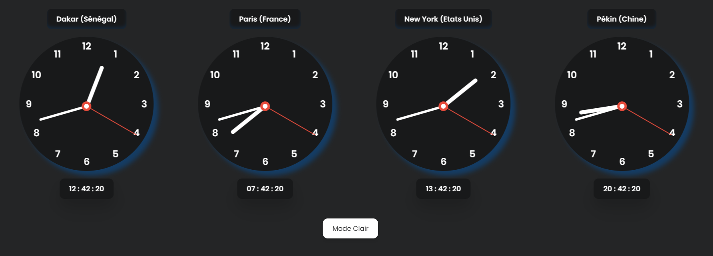

# 🕒 Horloge Numérique Dynamique

Ce projet est une **horloge numérique dynamique** développée avec **HTML**, **CSS** et **JavaScript**. Elle affiche l'heure en temps réel de **4 villes differentes**, au format `HHh : MMm : SSs` et se met à jour automatiquement chaque seconde.

---

## 📸 Aperçu

---

## ✨ Fonctionnalités

* Affichage **automatique** de l'heure actuelle en temps réel
* Mise à jour **chaque seconde**
* Format d'affichage personnalisé : `HHh : MMm : SSs`
* **Design responsive** et personnalisable

---

## 🛠️ Technologies utilisées

* **HTML** : structure de la page
* **CSS** : stylisation de l'interface
* **JavaScript** : logique de mise à jour de l'heure en temps réel